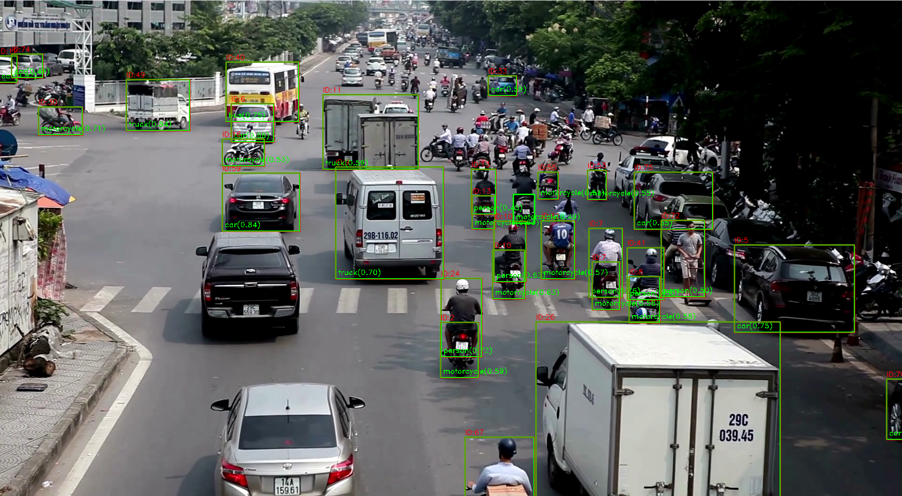

# OC-SORT C++ Library Tracker for any hardware



**Observation-Centric SORT (OC-SORT)** is a pure motion-model-based multi-object tracker. It aims to improve tracking robustness in **crowded scenes and when objects are in non-linear motion**. It is designed by recognizing and fixing limitations in Kalman filter and [SORT](https://arxiv.org/abs/1602.00763). It is flexible to integrate with different detectors and matching modules, such as appearance similarity. It remains, **Simple, Online and Real-time**.

| Dataset          | HOTA | AssA | IDF1 | MOTA | FP      | FN      | IDs   | Frag   |
| ---------------- | ---- | ---- | ---- | ---- | ------- | ------- | ----- | ------ |
| MOT17 (private)  | 63.2 | 63.2 | 77.5 | 78.0 | 15,129  | 107,055 | 1,950 | 2,040  |
| MOT17 (public)   | 52.4 | 57.6 | 65.1 | 58.2 | 4,379   | 230,449 | 784   | 2,006  |
| MOT20 (private)  | 62.4 | 62.5 | 76.4 | 75.9 | 20,218  | 103,791 | 938   | 1,004  |
| MOT20 (public)   | 54.3 | 59.5 | 67.0 | 59.9 | 4,434   | 202,502 | 554   | 2,345  |
| KITTI-cars       | 76.5 | 76.4 | -    | 90.3 | 2,685   | 407     | 250   | 280    |
| KITTI-pedestrian | 54.7 | 59.1 | -    | 65.1 | 6,422   | 1,443   | 204   | 609    |
| DanceTrack-test  | 55.1 | 38.0 | 54.2 | 89.4 | 114,107 | 139,083 | 1,992 | 3,838  |
| CroHD HeadTrack  | 44.1 | -    | 62.9 | 67.9 | 102,050 | 164,090 | 4,243 | 10,122 |

* Results are from reusing detections of previous methods and shared hyper-parameters. Tune the implementation adaptive to datasets may get higher performance.
* The inference speed is ~28FPS by a RTX 2080Ti GPU. If the detections are provided, the inference speed of OC-SORT association is 700FPS by a i9-3.0GHz CPU.

# Description 

This project is the C++ version of OC-SORT (OC-SORT: Observation-Centric SORT on video Multi-Object Tracking), and it utilizes the Eigen library for matrix operations. The project primarily refers to the official Python implementation of OC_SORT. The goal is to maintain consistency with the official Python version in terms of code logic and variable naming conventions. The linear assignment algorithm utilizes the open-source library Lap. The improved Kalman Filter in OC-SORT is implemented solely using the Eigen library.

## Feature

In the future, I may attempt to deploy an application that combines OC-SORT with a detector on resource-constrained devices.

## Speed

Currently, my device's CPU is Ryzen R5 2500U. When compiling with -O2 optimization, the average processing time for one frame is 5.5ms. This version I implemented is indeed slower than ByteTrack's C++ version, but the original Python version is much slower than ByteTrack. Refactoring the code into C++ has still provided improvement, so it's worth trying in a production environment.

# How it work?

Install: [Eigen](https://eigen.tuxfamily.org/index.php?title=Main_Page)

Install project `ANSLIB-BYTETRACK` into `src` folder contains the implementations of functions defined in the header files, while the `include` folder is responsible for defining the header files. To use it, simply package the entire OC_SORT as a dynamic link library.

## Example with CMake

Assuming the file directory is as follows:

```
├───include
├───src
├───test.cpp
└───CMakeLists.txt
```

`CMakeLists.txt` Content:

```cmake
cmake_minimum_required(VERSION 3.10)
project(libocsort)

set(CMAKE_CXX_STANDARD 17)
find_package(Eigen3 REQUIRED)
set(CMAKE_WINDOWS_EXPORT_ALL_SYMBOLS ON) # MSVC required
file(GLOB SRC_LIST src/*.cpp)

# compile as a DLL named project
add_library(${PROJECT_NAME} SHARED ${SRC_LIST})
target_include_directories(${PROJECT_NAME} PUBLIC include)
target_link_libraries(${PROJECT_NAME} Eigen3::Eigen)

# Test tracker work
add_executable(OCSORT test.cpp)
target_link_directories(OCSORT PUBLIC include)
target_link_libraries(test PUBLIC Eigen3::Eigen OCLib)
```


# About input-output formats
There are slight differences between the input-output formats of the modified version of OCSORT and the original version:

## Input format
Type of input: `Eigen::Matrix<double,Eigen::Dynamic,6>`

Format: `<x1>,<y1>,<x2>,<y2>,<confidence>,<class>`

## Output format
Type of output: `Eigen::Matrix<double,Eigen::Dynamic>`

Format: `<x1>,<y1>,<x2>,<y2>,<ID>,<class>,<confidence>`
This modification is done to facilitate the integration of OCSORT with other object detectors to form a complete object tracking pipeline.

## Example with C++:

### Vector2Matrix

The code you provided defines a function named `Vector2Matrix` that converts a 2D `std::vector` of float data into an `Eigen::Matrix<float, Eigen::Dynamic, 6>`.

Here's a breakdown of the code:

```cpp
Eigen::Matrix<float, Eigen::Dynamic, 6> Vector2Matrix(std::vector<std::vector<float>> data) {
    // Create an Eigen::Matrix with the same number of rows as the data and 6 columns
    Eigen::Matrix<float, Eigen::Dynamic, 6> matrix(data.size(), data[0].size());

    // Iterate over the rows and columns of the data vector
    for (int i = 0; i < data.size(); ++i) {
        for (int j = 0; j < data[0].size(); ++j) {
            // Assign the value at position (i, j) of the matrix to the corresponding value from the data vector
            matrix(i, j) = data[i][j];
        }
    }

    // Return the resulting matrix
    return matrix;
}

```

The function takes a 2D `std::vector` of float data as input, represented by the data parameter. It creates an `Eigen::Matrix<float, Eigen::Dynamic, 6>` named matrix with the same number of rows as the data vector (`data.size()`) and 6 columns.

Next, it uses nested for loops to iterate over the rows and columns of the data vector. It assigns the value at position `(i, j)` of the matrix to the corresponding value from the data vector (`data[i][j]`).

After iterating over all the elements of the data vector and assigning them to the matrix, the function returns the resulting matrix.

Note that this code assumes that the input data vector is non-empty and that all rows in the data vector have the same number of columns. It does not perform any input validation or error handling, so you should ensure that the input meets these assumptions before using the function.

### Operator 

The code you provided defines an overload of the `<<` operator for output streams (`std::ostream`) that allows you to print the contents of a `std::vector<AnyCls>` to the stream.

Here's a breakdown of the code:

```cpp
template<typename AnyCls>
std::ostream& operator<<(std::ostream& os, const std::vector<AnyCls>& v) {
    os << "{"; // Start printing with a curly brace

    // Iterate over the vector elements
    for (auto it = v.begin(); it != v.end(); ++it) {
        os << "(" << *it << ")"; // Print each element inside parentheses

        if (it != v.end() - 1) {
            os << ", "; // Add a comma and space if it's not the last element
        }
    }

    os << "}"; // End printing with a curly brace
    return os; // Return the stream
}
```
This code defines a templated function `operator<<` that takes two arguments: an output stream `(std::ostream& os)` and a constant reference to a `std::vector<AnyCls>` (`const std::vector<AnyCls>& v`). The AnyCls template parameter allows the vector to hold elements of any type.

Inside the function, it starts by outputting an opening curly brace (`{`) to the stream. Then it iterates over the elements of the vector using a for loop. For each element, it prints the element surrounded by parentheses (`(` and `)`), using *it to dereference the iterator and get the actual element. If the current element is not the last element in the vector, it adds a comma and a space after printing the element.

After iterating over all the elements, it outputs a closing curly brace (`}`) to the stream. Finally, it returns the stream itself (`os`), allowing for chaining of output operations.
### Final Process Object Detector + OC SORT 

The code you provided defines a function named `processFrame` that processes a frame using object detection and tracking algorithms. Let's break down the code step by step:
```cpp
void processFrame(const cv::Mat& frame, std::vector<Detection>& output, ocsort::OCSort& tracker) {
    std::vector<std::vector<float>> data;

    // Iterate over the output vector starting from index 1 (skipping the first element)
    for (int i = 1; i < output.size(); ++i) {
        Detection detection = output[i];
        cv::Rect box = detection.box;
        std::vector<float> row;
        for (;;) {
            // Push the coordinates, confidence, and class ID of the detection to the row vector
            row.push_back(output[i].box.x);
            row.push_back(output[i].box.y);
            row.push_back(output[i].box.x + output[i].box.width);
            row.push_back(output[i].box.y + output[i].box.height);
            row.push_back(output[i].confidence);
            row.push_back(output[i].class_id);
        }
        data.push_back(row); // Add the row vector to the data vector

        // Update the tracker with the data converted to an Eigen matrix
        std::vector<Eigen::RowVectorXf> res = tracker.update(Vector2Matrix(data));

        cv::rectangle(frame, box, cv::Scalar(0, 255, 0), 2); // Draw a rectangle around the detection

        // Add text indicating the class name and confidence to the frame
        std::string classString = detection.className + '(' + std::to_string(detection.confidence).substr(0, 4) + ')';
        cv::putText(frame, classString, cv::Point(box.x + 5, box.y + box.height - 10), cv::FONT_HERSHEY_DUPLEX, 0.5, cv::Scalar(0, 255, 0), 1, 0);

        // Process the results from the tracker
        for (auto j : res) {
            int ID = int(j[4]);
            int Class = int(j[5]);
            float conf = j[6];

            // Add ID text and draw a rectangle for each tracked object
            cv::putText(frame, cv::format("ID:%d", ID), cv::Point(j[0], j[1] - 5), 0, 0.5, cv::Scalar(0, 0, 255), 1, cv::LINE_AA);
            cv::rectangle(frame, cv::Rect(j[0], j[1], j[2] - j[0] + 1, j[3] - j[1] + 1), cv::Scalar(0, 0, 255), 1);
        }

        data.clear(); // Clear the data vector for the next iteration
    }
}
```
The function processFrame takes three parameters: a constant reference to a `cv::Mat` object representing a frame, a reference to a vector of Detection objects named output, and a reference to an `ocsort::OCSort` object named tracker.

Inside the function, a `std::vector<std::vector<float>>` named `data` is created to store the converted detection data. Then, the function iterates over the output vector starting from index 1 (skipping the first element) using a for loop. For each `Detection` object, the coordinates (x, y, width, height), confidence, and class ID are extracted and stored in a `std::vector<float>` named `row`. 


